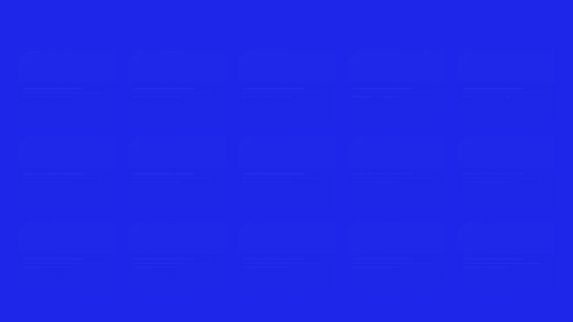
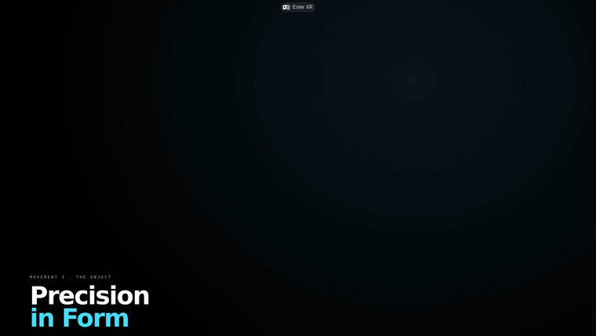
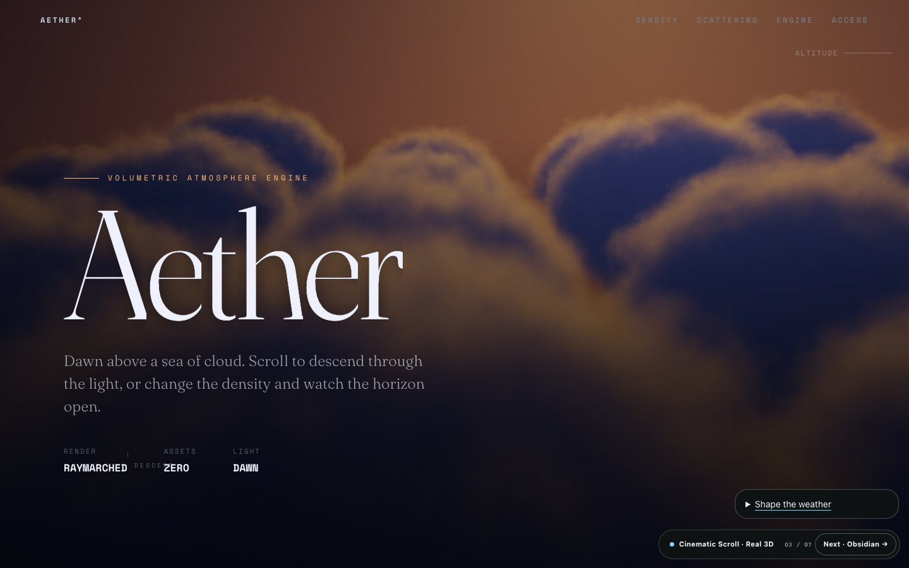
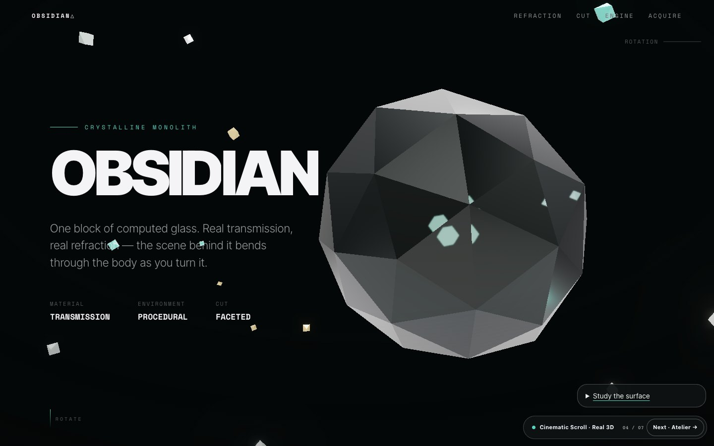
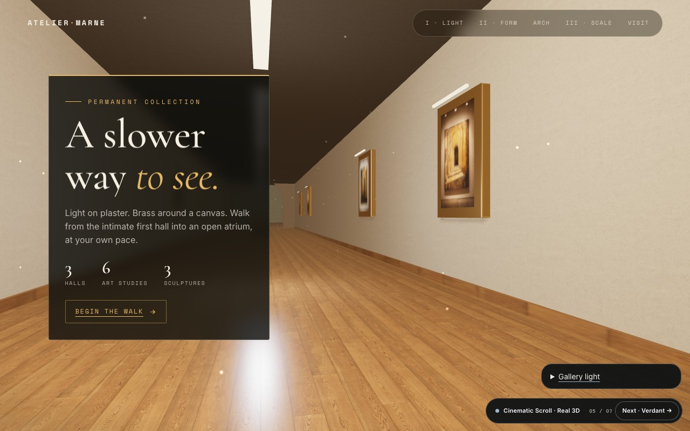
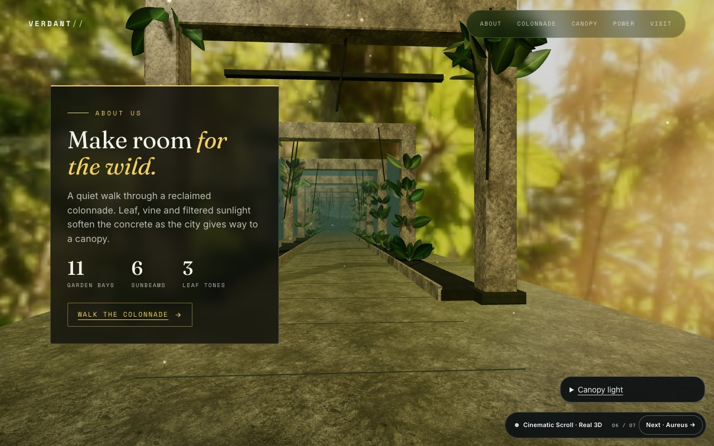
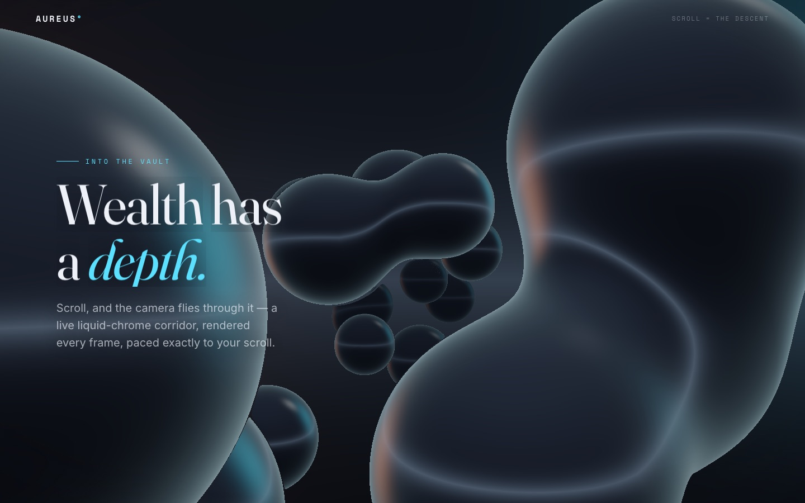

# Cinematic Scroll

### Make the page people remember.

[](https://www.npmjs.com/package/cinematic-scroll-skill)
[](https://github.com/MustBeSimo/cinematic-scroll-skill/actions/workflows/ci.yml)
[](./LICENSE)
[](https://github.com/MustBeSimo/cinematic-scroll-skill/stargazers)

<a href="https://mustbesimo.github.io/cinematic-scroll-skill/"></a>

<p align="center">
  <strong>One sentence in. A cinematic, scroll-driven website out.</strong><br>
  <a href="https://mustbesimo.github.io/cinematic-scroll-skill/">Live site</a> ·
  <a href="https://mustbesimo.github.io/cinematic-scroll-skill/examples/flagships/">Real 3D flagships</a> ·
  <a href="#install">Install</a> ·
  <a href="#normal-and-studio">Normal / Studio</a>
</p>

Cinematic Scroll is a free, MIT-licensed craft skill for coding agents. It helps turn a product, portfolio, launch, or story into a distinctive website with deliberate art direction, scroll choreography, resilient motion, and evidence that the result actually works.

It is not a prompt pack and it is not a runtime dependency. The skill guides the agent; the finished website stays yours.

```bash
npx skills add MustBeSimo/cinematic-scroll-skill
```

Then ask:

> Use cinematic-scroll to turn this product into a one-page story. Match the brand and assets in this project, create one memorable scroll reveal, and prove the mobile and reduced-motion versions.

No account, Studio purchase, TasteHQ key, or image-generation key is required.

## What you get

- A content-led story and visual direction before effects are chosen.
- Standalone HTML for a fast first page, or integration into an existing app.
- Pinned chapters, parallax, scrubbed video, kinetic type, and real 3D patterns.
- Eleven swappable visual systems and nine reusable components.
- Progressive fallbacks for touch, reduced motion, missing JavaScript, and WebGL failure.
- A deterministic doctor plus browser proof across desktop, mobile, reduced-motion, and no-JS profiles.
- Optional TasteHQ brand matching when a target URL or embedded grammar is available.

The agent chooses the lightest stack that can carry the story. Most pages do not need WebGL; when real depth matters, the same performance and fallback standards still apply.

## See the proof

### Seven Real 3D flagships

Seven live websites, seven different reasons to use depth. Every flagship is scrollable, source-visible, bounded by a performance budget, and backed by a designed fallback.

| | |
|---|---|
| [](https://mustbesimo.github.io/cinematic-scroll-skill/examples/flagship/) **[01 · Aether — Four Movements](https://mustbesimo.github.io/cinematic-scroll-skill/examples/flagship/)**<br><sub>Object · World · Field · Figure · WebXR</sub> | [](https://mustbesimo.github.io/cinematic-scroll-skill/examples/immersive/) **[02 · Nexus — Immersive Lab](https://mustbesimo.github.io/cinematic-scroll-skill/examples/immersive/)**<br><sub>Particles · wave physics · procedural field</sub> |
| [](https://mustbesimo.github.io/cinematic-scroll-skill/examples/volumetric-aether/) **[03 · Aether — Make Weather](https://mustbesimo.github.io/cinematic-scroll-skill/examples/volumetric-aether/)**<br><sub>Raymarched cloud volume · zero assets</sub> | [](https://mustbesimo.github.io/cinematic-scroll-skill/examples/crystalline-monolith/) **[04 · Obsidian — Refract It](https://mustbesimo.github.io/cinematic-scroll-skill/examples/crystalline-monolith/)**<br><sub>Physical transmission · PMREM · bloom</sub> |
| [](https://mustbesimo.github.io/cinematic-scroll-skill/examples/gallery-flythrough/) **[05 · Atelier Marne — Walk the Gallery](https://mustbesimo.github.io/cinematic-scroll-skill/examples/gallery-flythrough/)**<br><sub>Architectural flythrough · image-based light</sub> | [](https://mustbesimo.github.io/cinematic-scroll-skill/examples/jungle-flythrough/) **[06 · Verdant — Enter the Bloom](https://mustbesimo.github.io/cinematic-scroll-skill/examples/jungle-flythrough/)**<br><sub>Instanced foliage · pollen · god-rays</sub> |
| [](https://mustbesimo.github.io/cinematic-scroll-skill/examples/aureus-flythrough/) **[07 · Aureus — Enter the Vault](https://mustbesimo.github.io/cinematic-scroll-skill/examples/aureus-flythrough/)**<br><sub>Raymarched liquid chrome · scroll flight</sub> | **[Explore the full Real 3D collection →](https://mustbesimo.github.io/cinematic-scroll-skill/examples/flagships/)**<br><br>Each demo now links to the collection and the next spatial experiment, so the seven sites work as one portfolio. |

### More than one aesthetic

The motion grammar stays consistent; the art direction does not. Browse [27 live references](https://mustbesimo.github.io/cinematic-scroll-skill/#flagships), including Renaissance editorial, clinical noir, quiet luxury, brutalist studio, botanical publishing, data cinematic, warm scrapbook, and liquid chrome.

The visual systems live in [`themes/`](./themes/). The components live in [`components/`](./components/). They are starting points, not a fixed house style.

## Normal and Studio

The normal edition is the complete, useful product—not a trial.

| Normal · free forever | Studio · for repeat practice |
|---|---|
| Build complete cinematic websites | Build on accumulated project knowledge |
| Story and motion planning | Intent-based pattern retrieval |
| 27 references + 11 visual systems | Reuse tracking across builds |
| Components and Real 3D patterns | Learned variants from your own language |
| Doctor + five-profile browser proof | Deeper iteration without starting cold |
| Optional TasteHQ matching | Proprietary Motif Engine |

Use Normal for as many personal or commercial projects as you like. Use Studio when repeated work should compound into a visual memory.

**[Explore Studio →](https://buy.stripe.com/cNi7sLdNBbief0L0uFfnO09)** · [Compare editions](./references/editions.md) · [See how the stack fits](https://mustbesimo.github.io/cinematic-scroll-skill/stack/)

## Install

All paths install the same normal edition.

### Skills registry

```bash
npx skills add MustBeSimo/cinematic-scroll-skill
```

### npm installer

```bash
npx cinematic-scroll-skill
npx cinematic-scroll-skill --dir .cursor/skills
```

### Claude Code marketplace

```text
/plugin marketplace add MustBeSimo/cinematic-scroll-skill
/plugin install cinematic-scroll@mustbesimo
```

### Git clone

```bash
git clone https://github.com/MustBeSimo/cinematic-scroll-skill ~/.claude/skills/cinematic-scroll
```

For Claude Desktop, Cursor, Hermes, and OpenClaw paths, see [`COMPATIBILITY.md`](./COMPATIBILITY.md).

## Two build modes

### Mode A — a section or standalone page

Use this for a hero, a campaign page, or a fast concept. The output can be one runnable HTML file with no build step.

> Build a self-contained pinned hero for this brand. Keep the page readable without JavaScript and give touch devices a natural-flow version.

### Mode B — a full release site

Use this for multi-chapter stories and existing React/Next.js products. The skill preserves the installed framework and scroll provider, then integrates the sequence at a real route.

> Build a complete release story for this product inside the existing app. Reuse its design system, create one signature moment, and verify the built route.

The included [`templates/nextjs/`](./templates/nextjs/) project is available when a new Next.js scaffold is actually needed. Generated media through fal.ai is optional; demo mode and local assets work without a key.

## Quality is a gate

`cinematic-doctor` scores static craft and exits non-zero below the chosen threshold:

```bash
npm run doctor -- examples/flagship/index.html
```

The end-to-end verifier combines contract checks with browser evidence:

```bash
node tools/verify/verify-build.mjs ./index.html --phase polish
```

For a full interaction matrix:

```bash
node tools/page-proof/matrix.mjs ./index.html --out .verify/page-proof
```

That matrix covers desktop, mobile/touch, reduced motion on both layouts, and JavaScript disabled. A requested check that cannot run reports `INCOMPLETE`; a failed check reports `FAIL`. Neither is dressed up as success.

Install browser-tool dependencies once with `npm install` in the skill directory. Chrome or Chromium is needed only for screenshot proof, not to generate a standalone page.

## Design system and architecture

```text
SKILL.md                    compact agent contract and workflow router
design.md + tokens/        DTCG color, type, spacing, and motion contract
themes/                    eleven one-file visual systems
components/                nine named patterns in HTML and React
references/                story, build, motion, performance, 3D, and XR guidance
examples/                  live references, prompts, and Real 3D flagships
templates/nextjs/          optional full-site starter
tools/cinematic-doctor/    deterministic static quality gate
tools/page-proof/          browser screenshots and interaction matrix
tools/verify/              one-command verification orchestration
tools/tastehq/             optional brand query and score adapter
evals/                     triggering and workflow behavior checks
```

The main contract is [`SKILL.md`](./SKILL.md). It routes to detailed references only when the build needs them, keeping agent context smaller and decisions clearer.

### One choreography, two media

[`scroll-choreography.json`](./scroll-choreography.json) is a declarative timing source that can compile to a webpage timeline and launch-film markers. See [`compile-choreography.mjs`](./compile-choreography.mjs) and the [compilation contract](./scroll-choreography-compilation.md).

### Real 3D assets

The flagship can run procedurally before any model arrives. When assets are available, [`ASSETS-3D.md`](./ASSETS-3D.md) defines GLB/USDZ formats, scale, pivots, triangle caps, materials, camera nodes, and manifest paths so the upgrade is data—not a rewrite.

## Develop and verify this repo

```bash
npm install
npm test
```

The test suite checks tokens, themes, links, skill mirrors, components, the doctor, evals, benchmark behavior, verification semantics, browser-matrix orchestration, package contents, and the TasteHQ adapter.

Useful commands:

```bash
npm run tokens:check
npm run themes:check
npm run components:doctor
npm run proof -- examples/noir/index.html
npm run bench -- https://example.com
```

[`CinematicBench`](https://mustbesimo.github.io/cinematic-scroll-skill/bench/) is the companion passive benchmark for pacing, performance, accessibility, and motion craft.

## Principles

- Content and brand lead; effects follow.
- Use real 3D only when spatial depth carries meaning.
- One scroll clock, reversible setup, and no global teardown.
- Mobile is a composition, not a shrunken desktop.
- Reduced motion restores readable flow; it does not merely set duration to zero.
- A static poster or readable page is a designed state, not an apology.
- References inform direction without copying assets, logos, text, or exact compositions.

## License

MIT © 2026 [Simone Leonelli](https://w230.net). See [LICENSE](./LICENSE).

Built something with it? [Submit it to the showcase](https://github.com/MustBeSimo/cinematic-scroll-skill/issues/new?title=Showcase:%20) or email [simone@w230.net](mailto:simone@w230.net).
