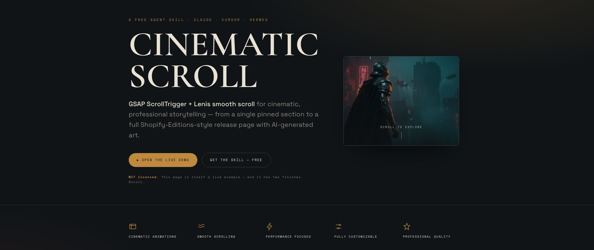
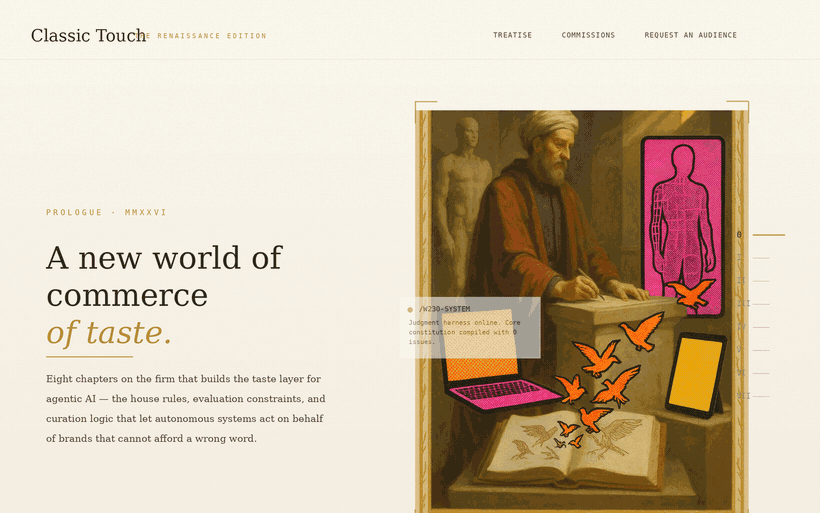

# Cinematic Scroll

<a href="https://mustbesimo.github.io/cinematic-scroll-skill/">
  <picture>
    <source media="(prefers-color-scheme: dark)" srcset="assets/banner-dark.png">
    <source media="(prefers-color-scheme: light)" srcset="assets/banner-light.png">
    
  </picture>
</a>

<sub>↑ The <a href="https://mustbesimo.github.io/cinematic-scroll-skill/">live landing page</a> adapts to your GitHub theme — <b>Petroleum Editorial</b> in dark mode, <b>Swiss Museum</b> in light. Toggle either finish on the site.</sub>

<a href="https://mustbesimo.github.io/cinematic-scroll-skill/examples/renaissance/">
  
</a>

<sub>↑ The <b>motion</b> is the skill — pinned chapters, multi-depth parallax, mask/stagger title reveals, a tracking index rail. The <b>look</b> is whatever you ask for. This clip happens to be a Renaissance editorial; the same grammar drives a brutalist drop, a neon Gen-Z launch, a noir game page, or your brand. <a href="https://mustbesimo.github.io/cinematic-scroll-skill/examples/renaissance/">Scroll it live →</a></sub>

**A free, open-source Agent Skill (Claude · Cursor · Hermes) for building cinematic, scroll-driven websites in any visual style.** You describe the aesthetic — palette, mood, references — and get pinned chapters, multi-depth parallax, 3D tilt, environment-morphing backgrounds, and full Shopify-Editions-style release pages, art-directed to match. The cinematic *motion* is the constant; the *look* is yours.

> **License:** MIT — free for any use, personal or commercial.
> **Status:** Provided as-is. Developed from applied experiments and working demos, then released as an open-source skill. Not actively maintained — issues and PRs are welcome but may sit. No warranty, no support SLA.

Built by [Simone Leonelli](https://w230.net) · [simone@w230.net](mailto:simone@w230.net)

---

## One grammar, any aesthetic

The cinematic motion stays constant; the visual world is whatever you describe. Each hero below is a **different aesthetic** the skill art-directs from a prompt — same parallax, same pinning, same title choreography underneath. Pick a world, or invent your own.

<table>
  <tr>
    <td width="33%"><br><sub><b>Brutalist editorial</b> — stark monochrome, raw grid</sub></td>
    <td width="33%"><br><sub><b>Quiet luxury</b> — earth palette, negative space</sub></td>
    <td width="33%"><br><sub><b>Gen-Z pop</b> — neon gradients, floating UI</sub></td>
  </tr>
  <tr>
    <td width="33%"><br><sub><b>Sci-fi noir</b> — teal + crimson, grain, edge light</sub></td>
    <td width="33%"><br><sub><b>Organic wellness</b> — blush, sage, painterly</sub></td>
    <td width="33%"><br><sub><b>Retro archive</b> — amber, analogue, scan-lines</sub></td>
  </tr>
</table>

<sub>Six prompts, six worlds — each art-directed by the skill's own [fal.ai](https://fal.ai) pipeline (or bring your own images / go CSS-only at $0). The Renaissance demo above is simply the **seventh**, built out end-to-end so you can scroll a finished one. None of these is "the style" — they're proof there isn't one.</sub>

---

## What it makes

This one skill works at two altitudes. Ask for a section, get a section. Ask for a site, get a site.

### Mode A — a scroll artifact
A single self-contained HTML (or `.tsx`) scroll section you can preview instantly — no build, no keys. Pinned chapters, 5–7 depth layers, scroll-driven 3D camera, mask/stagger title reveals, reduced-motion-safe.

> *"Build a pinned hero chapter for a luxury brand: muted palette, 220vh pin, title reveals via letter-spacing scrub, background drifts 3% over the full pin."*

### Mode B — a full release website
A complete Next.js App Router project scaffolded from tested templates: chaptered scroll choreography, a manifest-driven page, and an optional [fal.ai](https://fal.ai) pipeline that generates art-directed chapter imagery. Looks stunning on first paint with **zero** AI setup (CSS-only chapter visuals), then upgrades to real generated art when you add a key.

> *"Build a Shopify-Editions-tier release page for my product. Demo mode first — no key required. 8 chapters."*

---

## Two worked examples — opposite worlds, identical grammar

Same engine, deliberately clashing aesthetics. Both are **single, build-free `index.html` files** (GitHub-Pages-native): pinned chapters, multi-depth parallax, scroll-spy rail, background morph, 3D tilt — all from the skill's vanilla grammar. Proof the look is a variable, not a default.

<table>
  <tr>
    <td width="50%" valign="top">
      <a href="https://mustbesimo.github.io/cinematic-scroll-skill/examples/renaissance/"></a>
    </td>
    <td width="50%" valign="top">
      <a href="https://mustbesimo.github.io/cinematic-scroll-skill/examples/studio/"></a>
    </td>
  </tr>
  <tr>
    <td width="50%" valign="top">
      <a href="https://mustbesimo.github.io/cinematic-scroll-skill/examples/renaissance/"><b>① Renaissance editorial →</b></a><br>
      <sub>Warm, classical, ornate. Oil-painting heroes, gold↔oxblood morph, serif display. Mirrors the production edition at <a href="https://www.w230.net/reinassence">w230.net/reinassence</a>.</sub>
    </td>
    <td width="50%" valign="top">
      <a href="https://mustbesimo.github.io/cinematic-scroll-skill/examples/studio/"><b>② Brutalist creative-director →</b></a><br>
      <sub>Cold, modern, severe. Giant grotesk type, monochrome + electric-blue accent, grey↔ink morph, scroll-driven 3D camera. A fictional CD portfolio in the spirit of spare Swiss-editorial sites.</sub>
    </td>
  </tr>
</table>

Two prompts, two finished worlds. Swap the palette, references, and copy and the same machinery produces any of the aesthetics above.

```bash
python3 -m http.server 8099   # then open /examples/renaissance/  or  /examples/studio/
```

**Under the motion, every chapter ships with:**

| | |
|---|---|
| **Cinematic depth** | 5–7 parallax layers per chapter, perspective camera, dolly-back transitions |
| **Editorial type** | Oversized titles with word-stagger / clip-path mask / letter-spacing-scrub reveals |
| **Atmosphere morphs** | Backgrounds crossfade between chapter color-worlds as you scroll |
| **AI art direction** | fal.ai-generated heroes (FLUX.2, Nano Banana, Imagen) — or bring your own images |
| **Bulletproof basics** | Reduced-motion fallback, iOS video safety, mobile-stacked layout, transform/opacity-only hot paths designed for smooth scrolling; benchmark on target devices before production deployment. |

---

## Install

**Claude (Desktop / claude.ai):** Settings → Capabilities → Skills → **Upload skill** → drag the zipped folder.

**Cursor:** drop this folder into `.cursor/skills/` in any project; Cursor auto-discovers it.

**Hermes:** `hermes skill add https://github.com/MustBeSimo/cinematic-scroll-skill` (or unzip into `~/.hermes/skills/`).

Then trigger it in chat — see [`examples/PROMPTS.md`](./examples/PROMPTS.md) for 20+ copy-paste prompts across aesthetic worlds (brutalist editorial, quiet luxury, Gen-Z pop, Linear-minimal, sci-fi noir, organic wellness, typographic maximalism, retro).

---

## Quickstart

### Mode A — instant scroll section
> *"Use cinematic-scroll to build a self-contained HTML pinned hero chapter for [YOUR BRAND]. Include a progress HUD."*

You get one runnable `.html` file. Open it. Done.

### Mode B — full release site
> *"Use cinematic-scroll to scaffold a complete Shopify-Editions-tier release page for [YOUR PRODUCT IN ONE LINE]. Demo mode first — do not require my fal.ai key. Copy all bundled templates verbatim. 8 chapters. Finish with the exact commands to run."*

Then, in the scaffolded project:

```bash
npm install
npm run dev
```

Open `http://localhost:3000` — a full 8-chapter cinematic page, CSS-only visuals, **zero AI setup**.

Want real generated chapter art? Add your own [fal.ai](https://fal.ai) key and run the command below. Generation cost varies by model and resolution — see `MODELS.md` and current fal.ai pricing before running a batch.

```bash
npm run setup        # interactive key wizard → writes .env.local
npm run generate     # generates all chapter heroes into public/generated/
```

Full walkthrough: [`examples/GETTING_STARTED.md`](./examples/GETTING_STARTED.md). Model menu + costs: [`MODELS.md`](./MODELS.md).

---

## What's in the box

```
cinematic-scroll-skill/
├── SKILL.md                  # the agent contract (Mode A + Mode B). For Claude, not humans.
├── README.md                 # you are here
├── LICENSE                   # MIT
├── manifest.json             # skill metadata (free)
├── MODELS.md                 # fal.ai model menu, costs, when-to-use
├── examples/
│   ├── PROMPTS.md            # 20+ trigger prompts across aesthetic worlds
│   ├── GETTING_STARTED.md    # fal.ai setup, troubleshooting, queue+webhook
│   └── KNOWN_ISSUES.md       # QA log of real failure modes + fixes
└── templates/nextjs/         # tested, copy-verbatim Next.js App Router project
    ├── app/ (+ api/fal/*, generate-edition-asset)
    ├── components/ (ChapterScene, ChapterDemoVisual, EditionsPage, SmoothScrollProvider)
    ├── lib/ (editions-manifest, fal-*, prompt-contract, use-lenis, use-device)
    ├── scripts/ (setup.mjs, generate-chapter-assets.mjs)
    └── package.json, tailwind.config.ts, tsconfig.json, …
```

## Peer dependencies (in the consuming app)

```bash
npm install choreo-3d framer-motion gsap @gsap/react lenis @fal-ai/client @fal-ai/server-proxy
```

The motion primitives target the [`choreo-3d`](https://www.npmjs.com/package/choreo-3d) package, with a built-in **vanilla fallback** (sticky + IntersectionObserver + rAF) for sandboxes where npm packages can't be installed — identical math, same keyframes.

**On GSAP:** as of the 2025 Webflow acquisition, [GSAP is 100% free](https://gsap.com/) — every former Club plugin included (SplitText, ScrollSmoother, ScrollTrigger, MorphSVG…), commercial use too. The Next.js build (Mode B) uses **ScrollTrigger + SplitText** for pinning and title reveals; the single-file demos stay **dependency-free** (hand-rolled rAF — runs from `file://`, no build, no CDN). For low-level GSAP help, pair this with the official [`greensock/gsap-skills`](https://github.com/greensock/gsap-skills) — that skill teaches the GSAP API; this one teaches the cinematic system on top.

---

## Originality & legal

The reference direction is Shopify Editions, used **only** as an art-direction benchmark — chaptered release storytelling. The skill never copies Shopify's assets, logos, copy, source, or exact compositions, and never bakes readable UI text into generated images or imitates a named living artist. Generated assets may be used subject to fal.ai, model-provider and input-rights terms. Review output before commercial deployment.

## License

MIT © 2026 Simone Leonelli — see [LICENSE](./LICENSE).

Built something with it? I'd genuinely love to see it: **simone@w230.net**
