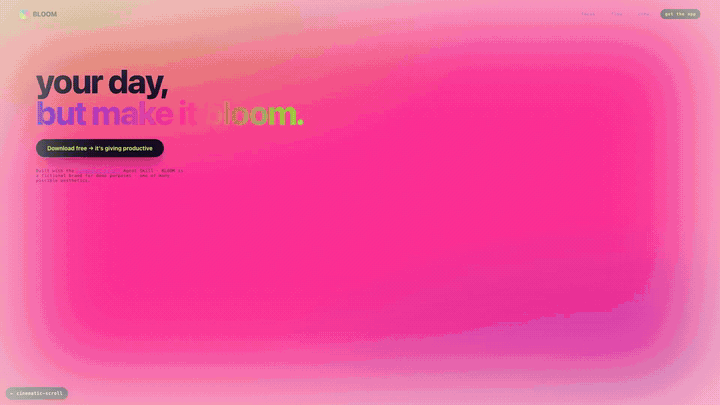
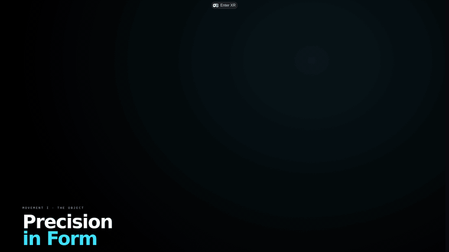
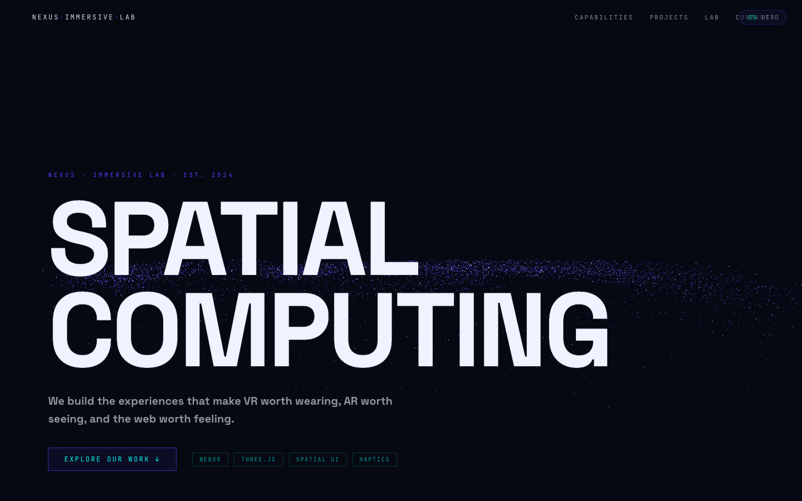
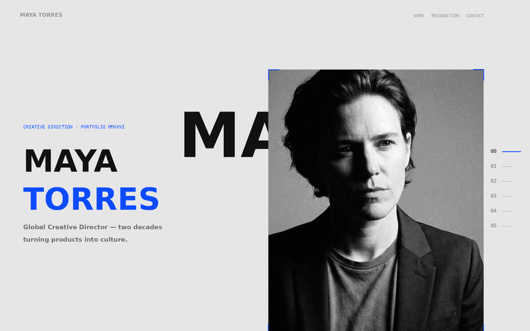
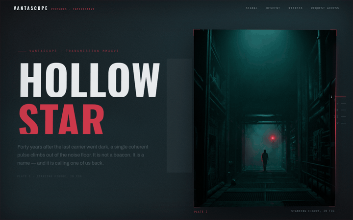
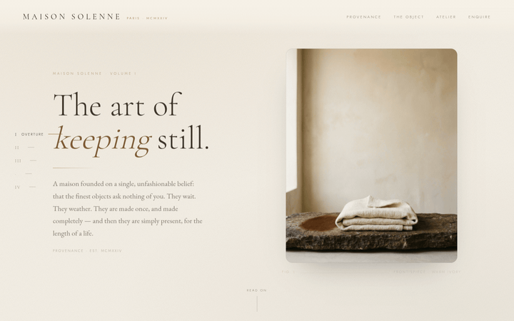
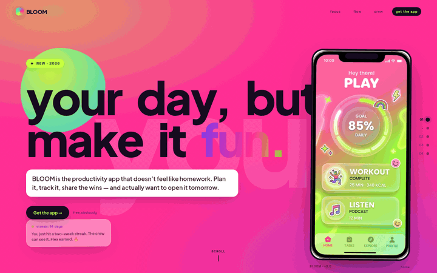
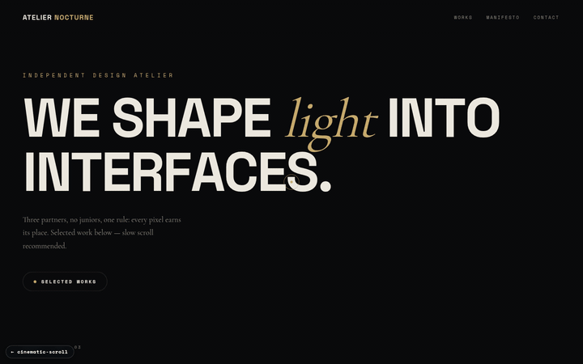

# Cinematic Scroll

### One sentence in. A cinematic, scroll-driven website out.

[](https://www.npmjs.com/package/cinematic-scroll-skill)
[](https://skills.sh/search?q=cinematic-scroll)
[](#install)
[](./LICENSE)
[](https://github.com/MustBeSimo/cinematic-scroll-skill/actions/workflows/ci.yml)
[](https://github.com/MustBeSimo/cinematic-scroll-skill/stargazers)

<a href="https://mustbesimo.github.io/cinematic-scroll-skill/">
  
</a>

<h2 align="center">
  <a href="https://mustbesimo.github.io/cinematic-scroll-skill/">🌐 &nbsp;Live demo — cinematic-scroll-skill.github.io</a>
</h2>
<p align="center">
  Built <em>with the skill itself</em> &nbsp;·&nbsp; adapts to your GitHub theme: dark → <strong>Petroleum Editorial</strong>, light → <strong>Swiss Museum</strong><br>
  <a href="https://mustbesimo.github.io/cinematic-scroll-skill/#how">▶ Watch the 30-second demo</a> &nbsp;·&nbsp;
  <a href="#flagships">⚡ Two 3D / WebXR flagships, live ↓</a>
</p>

<a href="https://mustbesimo.github.io/cinematic-scroll-skill/examples/renaissance/">
  
</a>

<sub>↑ The <b>motion</b> is the skill — pinned chapters, multi-depth parallax, mask/stagger title reveals, a tracking index rail. The <b>look</b> is whatever you ask for. This clip happens to be a Renaissance editorial; the same grammar drives a brutalist drop, a neon Gen-Z launch, a noir game page, or your brand. <a href="https://mustbesimo.github.io/cinematic-scroll-skill/examples/renaissance/">Scroll it live →</a></sub>

**A free, MIT-licensed *craft skill* that gives any coding agent — Claude, Cursor, Hermes, OpenClaw — the taste to build cinematic, scroll-driven websites.** Describe the aesthetic — palette, mood, references — and get a visual system, motion storyboard, pinned chapters, multi-depth parallax, 3D tilt, and full release pages art-directed to match. **The motion is the constant · the look is yours · the agent is your choice.** It's a skill, not a plugin — the craft travels with you across every agent.

> **Free for any use, personal or commercial (MIT).** Actively developed — built from production work and shipped open source. [Issues](https://github.com/MustBeSimo/cinematic-scroll-skill/issues), PRs, and [showcase submissions](https://github.com/MustBeSimo/cinematic-scroll-skill/issues/new?title=Showcase:%20) welcome — I collect what people build.

Built by [Simone Leonelli](https://w230.net) · [simone@w230.net](mailto:simone@w230.net)

---

## ✦ Cinematic taste is now a number you can gate on

Cinematic Scroll isn't a prompt pack — it's a **craft contract**: plan the motion, build the scene, compile it to **web *and* video**, then run a **doctor** that catches cinematic slop before it ships. **`cinematic-doctor`** scores any build **0–100** across taste, performance, a11y, mobile, and 3D — and exits non-zero below threshold, so quality is **CI-blockable**, not a vibe.

```bash
npm run doctor -- examples/noir/index.html
```

It already scores the bundled examples (noir **87**, luxe **88**) and the 3D/WebXR flagship (**100**). The same `scroll-choreography.json` compiles to the website *and* its launch film — one choreography, two media.

### Quality gate

```bash
node tools/cinematic-doctor/cli.mjs examples/luxe/index.html   # → score + per-category breakdown
npm run doctor -- examples/flagship/index.html                 # → 100
```

The doctor **exits non-zero below 80**, so you can wire it into CI and block builds that score under the bar. Its runtime twin, [`tools/page-proof/`](./tools/page-proof/), opens the build in headless Chromium and returns console errors + scroll screenshots — contract *and* evidence:

```bash
npm run proof -- examples/noir/index.html
```

<a id="flagships"></a>
### ⚡ Two 3D / WebXR flagships — real WebGL, both doctor 100/100

Beyond the build-free Mode-A worlds, the skill ships two **real-3D** reference sites. Open either live:

<table>
  <tr>
    <td width="50%" valign="top">
      <a href="https://mustbesimo.github.io/cinematic-scroll-skill/examples/flagship/"></a>
    </td>
    <td width="50%" valign="top">
      <a href="https://mustbesimo.github.io/cinematic-scroll-skill/examples/immersive/"></a>
    </td>
  </tr>
  <tr>
    <td width="50%" valign="top">
      <a href="https://mustbesimo.github.io/cinematic-scroll-skill/examples/flagship/"><b>🎬 3D Flagship — Four Movements →</b></a><br>
      <sub><b>React Three Fiber + WebXR</b>, captured from the live route. A scroll-driven camera rail through four 3D modalities (Object · World · Field · Figure): a fal.ai-generated hero artifact on its stage ring → an instanced colonnade hall → a pure-GLSL field → a rigged dancer samba-ing under a concert spotlight. Velocity-reactive rail dust, aurora curtains, volumetric shafts, bloom.<br><br><code>three.js</code> · <code>R3F</code> · <code>WebXR</code> · <code>Draco/WebP</code> · <code>fal.ai</code> — vanilla twin in <a href="./examples/flagship/">examples/flagship</a>.</sub>
    </td>
    <td width="50%" valign="top">
      <a href="https://mustbesimo.github.io/cinematic-scroll-skill/examples/immersive/"><b>⚡ Nexus Immersive — Spatial Computing →</b></a><br>
      <sub><b>Tier C procedural shaders</b> — no external model needed. A 15,000-particle galaxy field (custom GLSL vertex + fragment, per-particle phase), a 60×60 wave-equation displacement grid (indigo→cyan lerp), and a Lorenz-inspired attractor. A WebXR session gate shows <i>Enter VR</i> only when <code>navigator.xr.isSessionSupported</code> returns true; context-loss handled, rAF gated on visibility + IntersectionObserver, mobile canvas suppressed.<br><br><code>three.js</code> · <code>GLSL</code> · <code>WebXR</code> — source in <a href="./examples/immersive/">examples/immersive</a>.</sub>
    </td>
  </tr>
</table>

**The flagship in depth.** [`examples/flagship/`](./examples/flagship/) is one cinematic scroll site, four chapters, four 3D modalities — vanilla Three.js (Mode A) plus React Three Fiber + WebXR (Mode B). The 3D stack decision tree lives in [`references/3d-stack.md`](./references/3d-stack.md) (with [`references/webxr.md`](./references/webxr.md) and asset hand-off in [`ASSETS-3D.md`](./ASSETS-3D.md)).

Both tiers now carry the full experience: the vanilla example ships the **real Draco meshes** (the generated chronometer, the colonnade hall, and the rigged dancer — samba out of the box) plus the FX layer (velocity-reactive rail dust, fake-volumetric shafts, breathing stage rings, FOV kick), degrading to designed procedural geometry offline. The Mode-B twin in the Next.js template (`/flagship` — [`templates/nextjs/FLAGSHIP.md`](./templates/nextjs/FLAGSHIP.md)) adds on top:

- **Generate real 3D assets with one command.** `npm run generate:flagship` runs a two-stage fal.ai pipeline per chapter: an art-directed concept image (`fal-ai/nano-banana-2`), then image→3D (`fal-ai/trellis` by default, `fal-ai/hyper3d/rodin` for high-detail heroes). Each mesh is **auto-compressed in place** (Draco geometry + WebP textures, ~10–13 MB raw → ~1–3 MB) and **auto-normalized** at load to chapter height with its base on the floor — arbitrary generated scales and offsets are safe, including rigged (skinned) models.
- **The Figure dances out of the box.** The template ships a Mixamo-rigged, animation-baked dancer (`dancer.glb`, ~0.8 MB Draco'd) with root motion stripped so the samba stays planted on its stage ring — no Blender, no Mixamo account, no manual rigging step.
- **An immersive FX layer.** A scroll-velocity-reactive GPU dust field spans the whole camera rail (travel *feels* like travel — motes swell and stream, the lens FOV kicks, then everything settles at each dwell), aurora light curtains flow overhead, fake-volumetric shafts rake the colonnade and spotlight the dancer, the hero artifact levitates with an orbiting comet glint, and chapters materialize on arrival through damped presence gates. Atmosphere morphs **both** fog color and density per chapter; a blurred mirror floor, bloom, chromatic aberration, and film grain finish the frame.
- **The engineering contract holds.** Every effect answers `prefers-reduced-motion` with a composed still frame, the mobile path cuts particle counts and skips heavy passes, the scroll-camera freezes while a WebXR session presents, and the swap from procedural placeholder to generated `.glb` is **data, not code** (one manifest line).


---

## Get started — two paths

Pick how you want to build:

**Mode A: Single scroll section** — one runnable `.html` file, no build step, no keys. Perfect for a hero chapter or one-off section.  
**Mode B: Full release site** — complete Next.js project, tested templates, optional AI image generation pipeline. Best for product launches and multi-chapter stories.

---

## Install

Pick whichever channel fits your client. All four install the same skill.

### Claude Code — plugin marketplace (recommended for Claude Code)
```bash
/plugin marketplace add MustBeSimo/cinematic-scroll-skill
/plugin install cinematic-scroll@mustbesimo
```
Installs as a namespaced plugin and stays updatable with `/plugin marketplace update mustbesimo`.

### Any client — npx installer
```bash
npx cinematic-scroll-skill          # copies the skill into ~/.claude/skills/cinematic-scroll
npx cinematic-scroll-skill --dir .cursor/skills   # or a custom skills directory
```

### Any client — git clone
```bash
git clone https://github.com/MustBeSimo/cinematic-scroll-skill ~/.claude/skills/cinematic-scroll
```

### Registries
```bash
npx skills add MustBeSimo/cinematic-scroll-skill   # skills.sh
```
Also listed on **[agentskills.io](https://agentskills.io)** (search "cinematic-scroll").

### Platform-specific
Paths vary by client — see [`COMPATIBILITY.md`](./COMPATIBILITY.md) for step-by-step instructions:
- **Claude Desktop** — Settings → Capabilities → Skills → Upload
- **Cursor** — drop into `.cursor/skills/` (or `npx cinematic-scroll-skill --dir .cursor/skills`)
- **Hermes Agent** — `hermes skills install MustBeSimo/cinematic-scroll-skill` (repo form — pulls the full multi-file skill, including `references/`, `templates/`, and `tools/`), or `git clone` to `~/.hermes/skills/`
- **OpenClaw** — via [ClawHub](https://clawhub.ai), the OpenClaw skill registry: `clawhub install cinematic-scroll` (or `openclaw skills install git:MustBeSimo/cinematic-scroll-skill@main`)

### Quick start
After installing, describe what you want to build in chat — see [`examples/PROMPTS.md`](./examples/PROMPTS.md) for 20+ copy-paste examples across aesthetic worlds.

---

## Live examples — five scrollable worlds, one grammar

Same engine, deliberately clashing aesthetics — five **single, build-free `index.html` files** (GitHub-Pages-native) running the skill's **Mode A** grammar: vanilla JS on `requestAnimationFrame` with optional GSAP/ScrollTrigger enhancements. All five retain a dependency-free core; Noir, Luxe, and Pop progressively enhance one showcase beat with deferred GSAP + ScrollTrigger (loaded from CDN with vanilla fallback). All five render fully with **zero image files** (CSS-only placeholders that upgrade when you add stills). Proof the look is a variable, not a default.

<table>
  <tr>
    <td width="50%" valign="top">
      <a href="https://mustbesimo.github.io/cinematic-scroll-skill/examples/renaissance/"></a>
    </td>
    <td width="50%" valign="top">
      <a href="https://mustbesimo.github.io/cinematic-scroll-skill/examples/studio/"></a>
    </td>
  </tr>
  <tr>
    <td width="50%" valign="top">
      <a href="https://mustbesimo.github.io/cinematic-scroll-skill/examples/renaissance/"><b>① Renaissance editorial →</b></a><br>
      <sub>Warm, classical, ornate. Oil-painting heroes, gold↔oxblood morph, serif display. Mirrors the production edition at <a href="https://www.w230.net/reinassence">w230.net/reinassence</a>. <a href="./examples/renaissance/">Source</a>.</sub>
    </td>
    <td width="50%" valign="top">
      <a href="https://mustbesimo.github.io/cinematic-scroll-skill/examples/studio/"><b>② Brutalist creative-director →</b></a><br>
      <sub>Cold, modern, severe. Giant grotesk type, monochrome + electric-blue accent, grey↔ink morph, scroll-driven 3D camera. A fictional CD portfolio in the spirit of spare Swiss-editorial sites. <a href="./examples/studio/">Source</a>.</sub>
    </td>
  </tr>
</table>

<table>
  <tr>
    <td width="33%" valign="top">
      <a href="https://mustbesimo.github.io/cinematic-scroll-skill/examples/noir/"></a>
    </td>
    <td width="33%" valign="top">
      <a href="https://mustbesimo.github.io/cinematic-scroll-skill/examples/luxe/"></a>
    </td>
    <td width="33%" valign="top">
      <a href="https://mustbesimo.github.io/cinematic-scroll-skill/examples/pop/"></a>
    </td>
  </tr>
  <tr>
    <td width="33%" valign="top">
      <a href="https://mustbesimo.github.io/cinematic-scroll-skill/examples/noir/"><b>③ Signal clean →</b></a><br>
      <sub>Studio <b>VANTASCOPE</b>, title <b>HOLLOW STAR</b>. Warm-white canvas, massive near-black Oswald type, single crimson signal accent — clean editorial sci-fi. 4 chapters, scroll-linked 3D camera, vertical mask-wipe title reveals. <a href="./examples/noir/">Source</a>.</sub>
    </td>
    <td width="33%" valign="top">
      <a href="https://mustbesimo.github.io/cinematic-scroll-skill/examples/luxe/"><b>④ Quiet luxury →</b></a><br>
      <sub>Maison <b>SOLENNE</b>. Warm ivory + sand, muted cognac accent, thin-serif display, vast negative space. 220vh pins, ~3% background drift, letter-spacing-scrub reveals. <a href="./examples/luxe/">Source</a>.</sub>
    </td>
    <td width="33%" valign="top">
      <a href="https://mustbesimo.github.io/cinematic-scroll-skill/examples/pop/"><b>⑤ Gen-Z pop →</b></a><br>
      <sub>App <b>BLOOM</b>. Candy-pink + electric-lime gradients, bold rounded type, fast parallax, floating CSS phone-UI. <a href="./examples/pop/">Source</a>.</sub>
    </td>
  </tr>
</table>

<table>
  <tr>
    <td width="50%" valign="top">
      <a href="https://mustbesimo.github.io/cinematic-scroll-skill/examples/atelier/"></a>
    </td>
    <td width="50%" valign="top">
      <a href="https://mustbesimo.github.io/cinematic-scroll-skill/examples/atelier/"><b>⑥ Awwwards techniques →</b></a><br>
      <sub><b>ATELIER NOCTURNE</b> — the second-generation vocabulary, all five techniques in one build-free file: <b>shader-distorted imagery</b> (scroll-velocity ripple + RGB split + hover bulge, hand-rolled WebGL, DOM stays the source of truth), <b>kinetic typography</b> (per-char velocity skew), a <b>magnetic cursor</b>, a <b>preloader→hero handoff</b>, and <b>page-transition wipes</b> — every one reduced-motion-safe. Pattern doc: <a href="./references/awwwards-techniques.md"><code>references/awwwards-techniques.md</code></a> · <a href="./examples/atelier/">Source</a>. Doctor: <b>100/100</b>.</sub>
    </td>
  </tr>
</table>

**Same motion grammar; any aesthetic.** These six examples show different visual directions the skill can art-direct — change the copy, palette, and references, and the same engine produces any world you describe. This isn't an exhaustive list of *styles* (the styling is infinite). It's a proof that the cinematic *motion* is the constant, and the *look* is whatever you ask for. (Plus the two **[3D / WebXR flagships](#flagships)** above.)

### Running locally

```bash
python3 -m http.server 8099   # then open /examples/renaissance/ · /studio/ · /noir/ · /luxe/ · /pop/
```

**Under the motion, every chapter ships with:**

| | |
|---|---|
| **Cinematic depth** | 5–7 parallax layers per chapter, perspective camera, dolly-back transitions |
| **Editorial type** | Oversized titles with word-stagger / clip-path mask / letter-spacing-scrub reveals |
| **Atmosphere morphs** | Backgrounds crossfade between chapter color-worlds as you scroll |
| **Image pipeline** | Optional: fal.ai-generated heroes (FLUX.2, Nano Banana, Imagen); required: bring your own images or render CSS-only visuals. Generated assets remain subject to your input rights and model-provider terms — review output before commercial deployment. |
| **Bulletproof basics** | Reduced-motion fallback, iOS video safety, mobile-stacked layout, transform/opacity-only core hot paths; optional GSAP showcase enhancements in selected examples; no WebGL required. Validate performance on target devices before production. |

---

## ✦ New: one choreography, two media

A single **`scroll-choreography.json`** now compiles to **the website *and* its
launch film** — same beats, same easings, same depth choreography. Rebrand your
site, and the video rebrands itself.

```bash
node compile-choreography.mjs scene.json --target web     # → GSAP ScrollTrigger page
node compile-choreography.mjs scene.json --target video   # → paused timeline for HyperFrames / Remotion
node compile-choreography.mjs scene.json --harness --out preview.html   # → watch it move, zero install
node compile-choreography.mjs scene.json --target hyperframes           # → render-ready composition → MP4
```

The web target is scroll-driven and responsive; the video target is a
deterministic 16:9 timeline for HTML-to-video renderers — directed by
**[`FRAME.md`](./FRAME.md)**, the brand spec that translates this design system
for the frame. The `--harness` flag emits a self-contained preview HTML with
play/scrub controls so you can watch any choreography in a plain browser.

Same DOM contract (`[data-chapter]` / `[data-layer]` / `[data-title]`) serves
both targets. Full mapping table + Remotion adapter:
[`scroll-choreography-compilation.md`](./scroll-choreography-compilation.md) ·
mixing strategy (HyperFrames × Remotion): [`video/PIPELINE.md`](./video/PIPELINE.md)

Reference film projects — both stacks, ready to render:

| Film | Stack | Length | What it covers |
|---|---|---|---|
| [`video/ship-in-5/`](./video/ship-in-5/) | HyperFrames | 60s | the launch guide: install → prompt → compose → ship |
| [`video/flagship-3d/`](./video/flagship-3d/) | HyperFrames | 60s | the 3D/WebXR flagship — built on **real captures of the live route** (hero frame, virtual-time scroll-through, concept→mesh, the spotlit dancer) |
| [`video/doctor/`](./video/doctor/) | HyperFrames | 45s | **"Scored"** — the cinematic-doctor film: the scan, the 0–100 score landing, the CI gate blocking a 64 and stamping an 87 PASS |
| `Promo` + `TwoMedia` + `Flagship3D` + `Doctor` in [`video/`](./video/) | Remotion | 24–30s each | the product promo, the "one choreography, two media" feature film, the flagship launch film built on the same live captures (`npm run render:flagship`), and the doctor quality-gate film (`npm run render:doctor`) |

Every HyperFrames film has a Remotion twin (and vice versa) — two renderers,
one art direction, so you can A/B the stacks or pick per platform.

---

## Quickstart

### Mode A — instant scroll section
> *"Use cinematic-scroll to build a self-contained HTML pinned hero chapter for [YOUR BRAND]. Include a progress HUD."*

You get one runnable `.html` file. Open it. Done.

### Mode B — full release site
> *"Use cinematic-scroll to scaffold a complete Shopify-Editions-tier release page for [YOUR PRODUCT IN ONE LINE]. Demo mode first — do not require my fal.ai key. Copy all bundled templates verbatim. 8 chapters. Finish with the exact commands to run."*

Then, in the scaffolded project:

```bash
npm install
npm run dev
```

Open `http://localhost:3000` — a full 8-chapter cinematic page, CSS-only visuals, **zero AI setup**.

Want real generated chapter art? Add your own [fal.ai](https://fal.ai) key and run the command below. Generation cost varies by model and resolution — see `MODELS.md` and current fal.ai pricing before running a batch.

```bash
npm run setup        # interactive key wizard → writes .env.local
npm run generate     # generates all chapter heroes into public/generated/
```

Full walkthrough: [`examples/GETTING_STARTED.md`](./examples/GETTING_STARTED.md). Model menu + costs: [`MODELS.md`](./MODELS.md).

---

## What's in the box

```
cinematic-scroll-skill/
├── SKILL.md                  # the agent contract (Mode A + Mode B). For Claude, not humans.
├── README.md                 # you are here
├── COMPATIBILITY.md          # platform installation & verification (Claude, Cursor, Hermes, OpenClaw)
├── LICENSE                   # MIT
├── manifest.json             # skill metadata (free)
├── MODELS.md                 # fal.ai model menu, costs, when-to-use
├── ASSETS-3D.md              # 3D asset hand-off: generate → compress → normalize → manifest
├── compile-choreography.mjs  # ✦ scroll-choreography.json → page / film / preview
├── scroll-choreography.json  # the declarative choreography schema + example
├── FRAME.md                  # brand spec for video agents (the frame translation)
├── taste-guardrails.md       # banned patterns, cinematic vocabulary, pacing rules
├── references/               # scroll patterns · film archetypes · perf budget · 3d-stack · webxr
├── tools/cinematic-doctor/   # ✦ the 0–100 quality gate (taste·perf·a11y·mobile·3D, CI-blockable)
├── video/                    # PIPELINE.md (HyperFrames × Remotion) + the film projects
│   ├── src/                  # Remotion: Promo · TwoMedia · Flagship3D · Doctor
│   ├── ship-in-5/            # HyperFrames: the 60s launch guide
│   ├── flagship-3d/          # HyperFrames: "Four Movements" (the 3D flagship film)
│   └── doctor/               # HyperFrames: "Scored" (the quality-gate film)
├── examples/
│   ├── PROMPTS.md            # 20+ trigger prompts across aesthetic worlds
│   ├── GETTING_STARTED.md    # fal.ai setup, troubleshooting, queue+webhook
│   ├── KNOWN_ISSUES.md       # QA log of real failure modes + fixes
│   ├── renaissance/          # Mode A example — warm classical editorial
│   ├── studio/               # Mode A example — brutalist creative-director portfolio
│   ├── noir/                 # Mode A example — signal clean / editorial sci-fi (VANTASCOPE)
│   ├── luxe/                 # Mode A example — quiet luxury (Maison Solenne)
│   ├── pop/                  # Mode A example — Gen-Z pop (BLOOM)
│   └── flagship/             # the 3D/WebXR flagship — four chapters, four 3D modalities
└── templates/nextjs/         # tested, copy-verbatim Next.js App Router project
    ├── app/ (+ /flagship route, api/fal/*, generate-edition-asset)
    ├── components/ (ChapterScene, EditionsPage, flagship/ — chapters + fx layer)
    ├── lib/ (editions-manifest, flagship-manifest, normalize-model, fal-*, use-lenis)
    ├── scripts/ (setup.mjs, generate-chapter-assets.mjs, generate-flagship-assets.mjs)
    └── package.json, tailwind.config.ts, tsconfig.json, FLAGSHIP.md, …
```

## Peer dependencies (in the consuming app)

```bash
npm install choreo-3d framer-motion gsap @gsap/react lenis @fal-ai/client @fal-ai/server-proxy
```

The motion primitives target the [`choreo-3d`](https://www.npmjs.com/package/choreo-3d) package, with a built-in **vanilla fallback** (sticky + IntersectionObserver + rAF) for sandboxes where npm packages can't be installed — identical math, same keyframes.

**On GSAP:** as of the 2025 Webflow acquisition, [GSAP is 100% free](https://gsap.com/) — every former Club plugin included (SplitText, ScrollSmoother, ScrollTrigger, MorphSVG…), commercial use too. The Next.js build (Mode B) uses **ScrollTrigger + SplitText** for pinning and title reveals; the standalone demos retain a **vanilla rAF core** with optional deferred GSAP enhancements in selected showcase beats (loaded from CDN with vanilla fallback). This means Mode A files run from `file://` with zero build, and gracefully fall back to CSS-only rendering if the CDN is unavailable. For low-level GSAP help, pair this with the official [`greensock/gsap-skills`](https://github.com/greensock/gsap-skills) — that skill teaches the GSAP API; this one teaches the cinematic system on top.

---

## Originality & legal

The reference direction is Shopify Editions, used **only** as an art-direction benchmark — chaptered release storytelling. The skill never copies Shopify's assets, logos, copy, source, or exact compositions, and never bakes readable UI text into generated images or imitates a named living artist. Generated assets may be used subject to fal.ai, model-provider and input-rights terms. Review output before commercial deployment.

## License

MIT © 2026 Simone Leonelli — see [LICENSE](./LICENSE).

Built something with it? I'd genuinely love to see it: **simone@w230.net**
</content>
</invoke>
