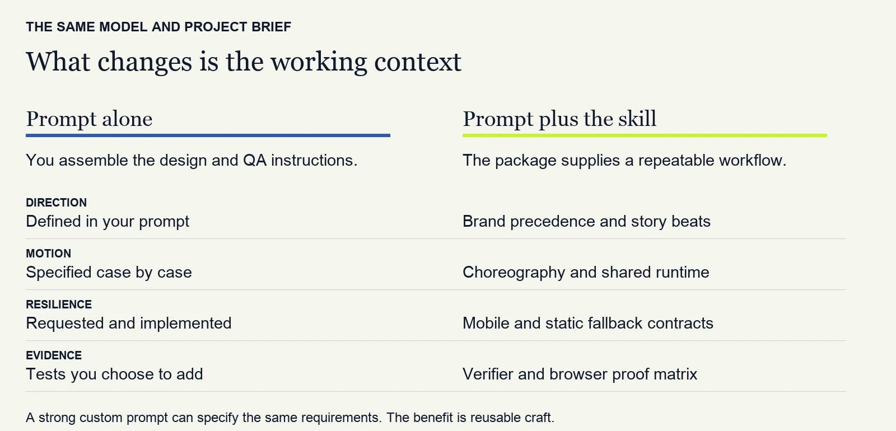
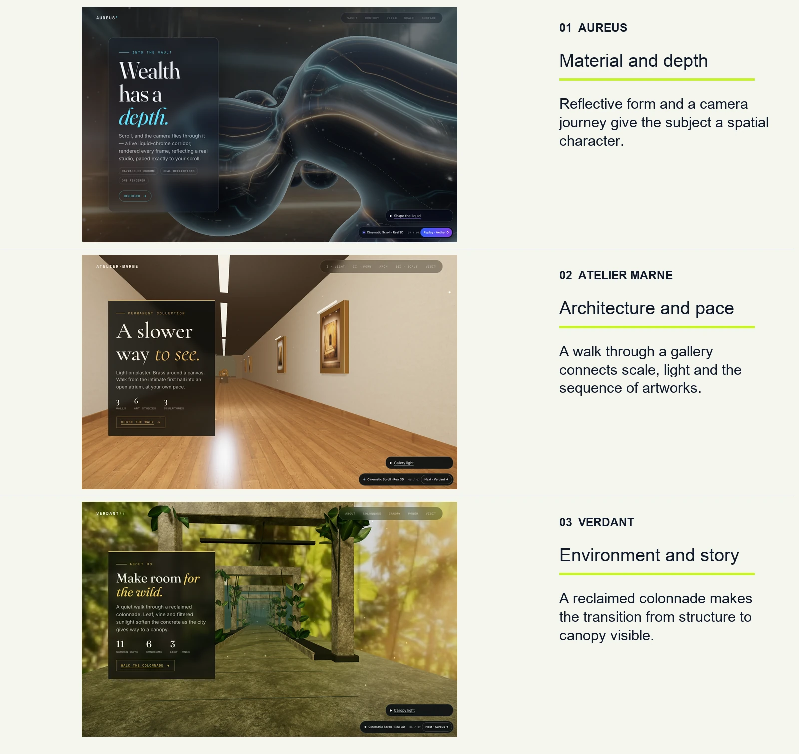
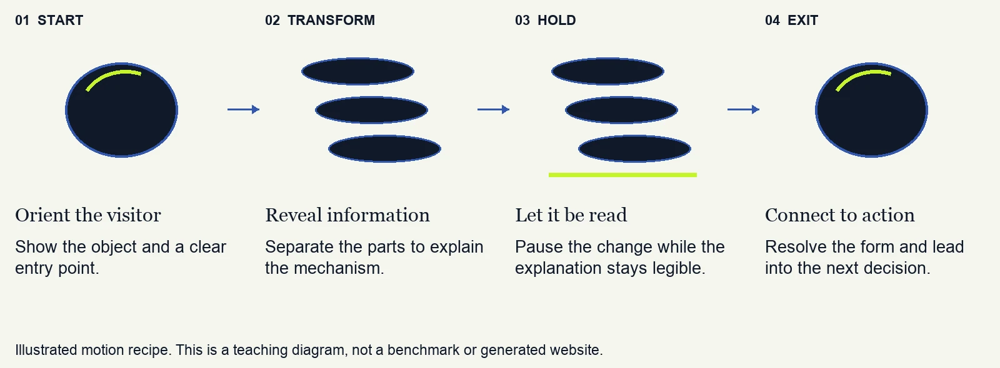
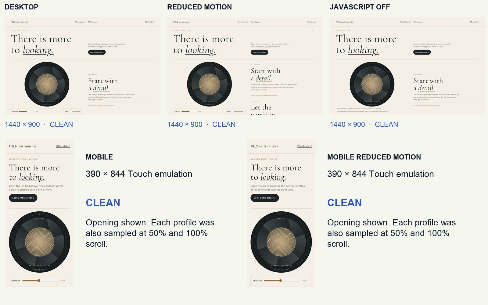

# What Web Design Studio adds to an LLM

Web Design Studio packages design decisions, implementation patterns and checks
for coding agents. Its practical value is a reusable working standard for
cinematic websites: your brand and subject determine the look, while the skill
supplies a process for building and inspecting it.

[Download the five-page illustrated guide](web-design-studio-visual-evidence.docx)
· [Read the skill contract](../../SKILL.md)

## Reusable craft



A strong custom prompt can specify the same requirements. This comparison shows
what the package supplies; it is not a measured comparison of model outputs.

## Different subjects and visual worlds



Open [Aureus](https://mustbesimo.github.io/web-design-studio/examples/aureus-flythrough/),
[Atelier Marne](https://mustbesimo.github.io/web-design-studio/examples/gallery-flythrough/)
or [Verdant](https://mustbesimo.github.io/web-design-studio/examples/jungle-flythrough/).
These are existing examples, not first-build benchmark results. Captures preserve
the original in-page labels. A still image does not establish interaction quality.

## Motion that explains



The skill asks for observable decisions, complete mobile and static compositions,
one owner per animated property and scoped cleanup. Those are requirements to
implement and test, not automatic guarantees.

## Verification actually run

Checked **12 September 2026**, source **v2.7.6**, commit
[`5d37540`](https://github.com/MustBeSimo/web-design-studio/tree/5d37540e767365761df550888d9ee94336ac179d).

| Check | Observed result | Scope |
| --- | --- | --- |
| Reference fixtures | 6 of 6 passed | Committed reference files satisfy their specified static checks. |
| Verifier failure-path tests | 9 of 9 passed | Tested failure and missing-evidence paths behave as required. |
| FIELD browser matrix | 5 of 5 CLEAN | No reported runtime/layout errors at the sampled depths. |



Desktop: 1440 × 900. Mobile: 390 × 844 with touch emulation. Normal and
reduced-motion profiles at both sizes, plus desktop with JavaScript disabled.
Each sampled 0%, 50% and 100% scroll with a 1.5-second settle time. FIELD was
opened as its self-contained local HTML. The three 3D examples were captured
over local HTTP because their module imports require an HTTP origin.

[Validation data](validation.json) · [Fixture output](fixtures.txt) ·
[Verifier test output](verifier-tests.txt) · [Browser-proof methodology](../../tools/page-proof/README.md)

Source paths in the validation data are repository-relative. Screenshot names
identify the three samples per profile; the composite above is included in this
public evidence package. Original full-resolution captures remain with the
document's local authoring files.

### Reproduce

Run from a checkout of the recorded source commit, with the documented browser
dependencies installed:

```sh
node evals/run.mjs
node --test tools/verify/verify.test.mjs
node tools/page-proof/matrix.mjs examples/v3-flagship/index.html --out .verify/field-evidence --shots 0,0.5,1 --wait 1500
```

These observations do not certify every generated page, WCAG conformance,
physical iPhone Safari, conversion or performance on every device. Trigger
accuracy and the three agent build specs were not evaluated. The source snapshot
and checks above remain historical evidence when the current release advances.

## Validate the comparative claim

A three-build exploratory comparison (one brief, ordinary prompt vs. expert prompt vs. skill, same model) was run on 13 September 2026 — see [`bench/skill-ab/`](../../bench/skill-ab/). It is not a benchmark and found no correctness advantage for the skill on that brief. No larger head-to-head benchmark has been run. Compare a short prompt, a detailed
expert prompt and the skill-assisted workflow using the same model, assets,
tools and total token budget, including skill reads. Run three briefs three
times per condition in fresh contexts: 27 builds. Preserve all first builds,
costs, repair attempts and failures.

Use identical external checks and blinded reviewers for brand fit, composition,
motion purpose and mobile readability. Report medians, spread, failures and ties,
including cases where the skill loses. This pilot can support a bounded claim;
the existing fixture and example checks cannot substitute for it.
